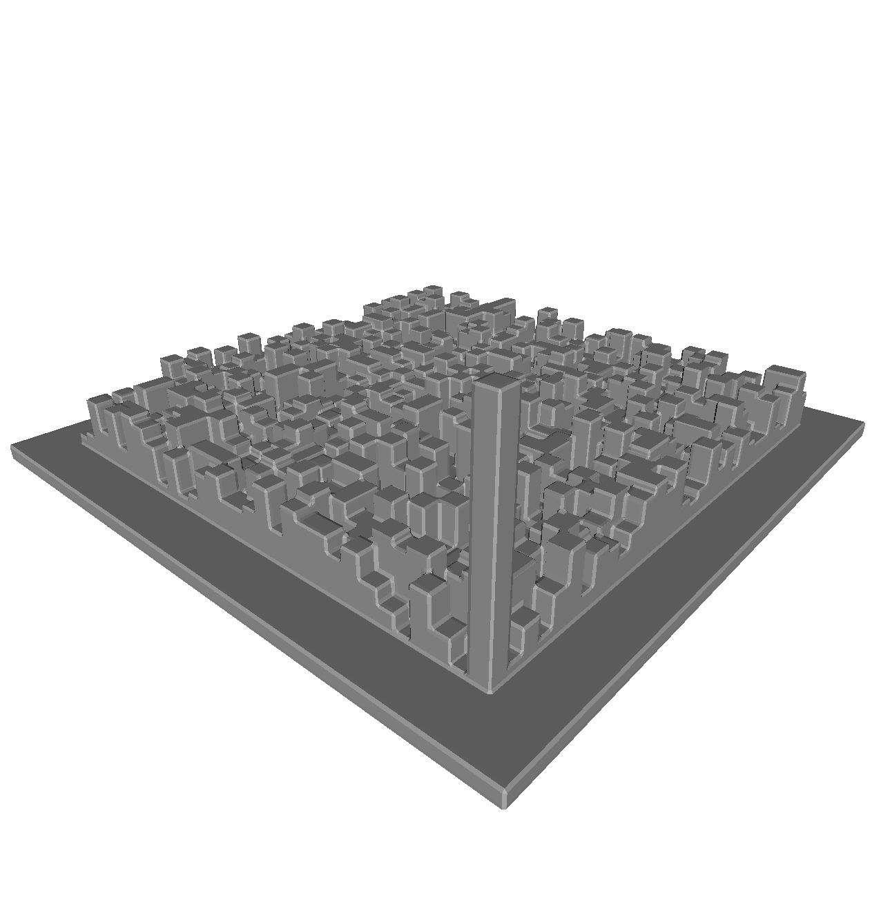

# Pi3d

Creates an 3d model of the digits of pi where the height of each block corresponds to each digit.

The grid can be resized up to 10k blocks with the default pi digits file but it's a bit slow.

### How to run it

Just edit the constants in the main.go and run it with `go run main.go` (or build it if you want).